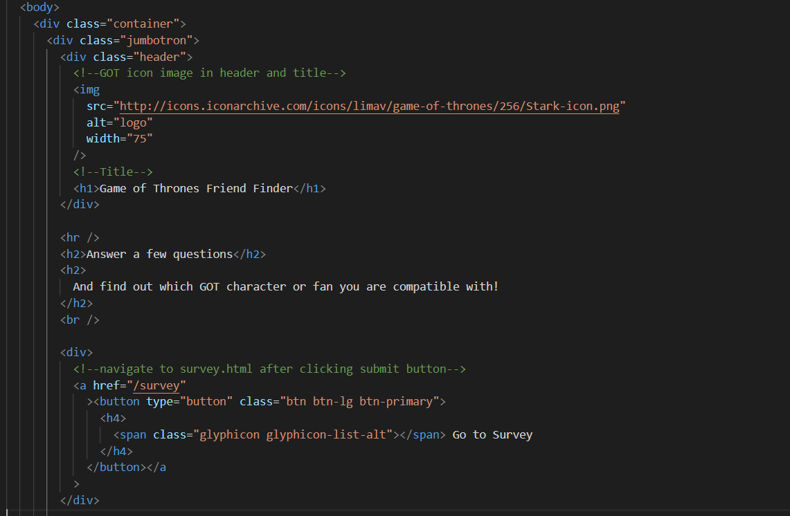
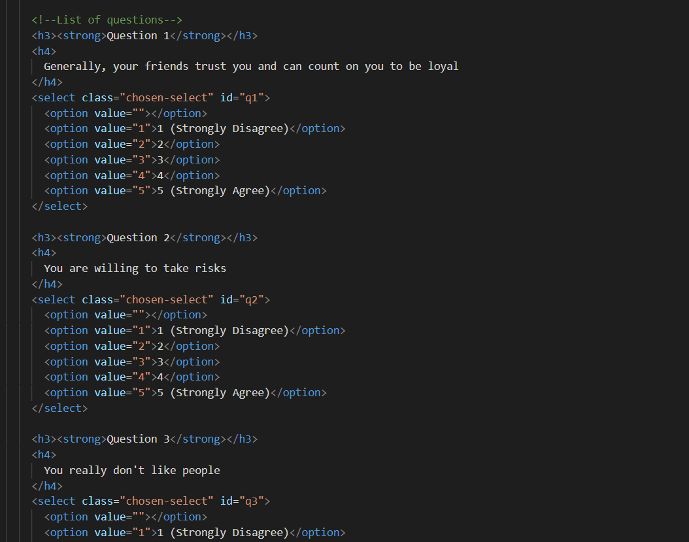
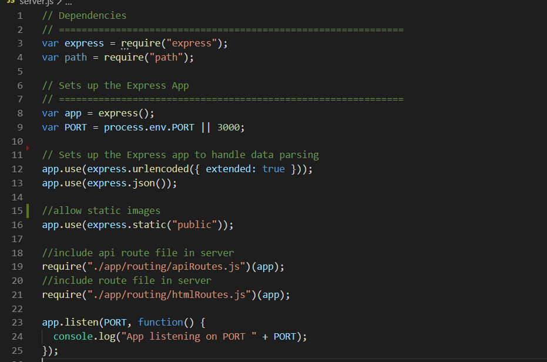
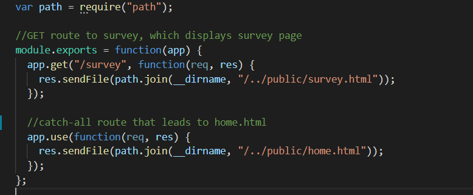
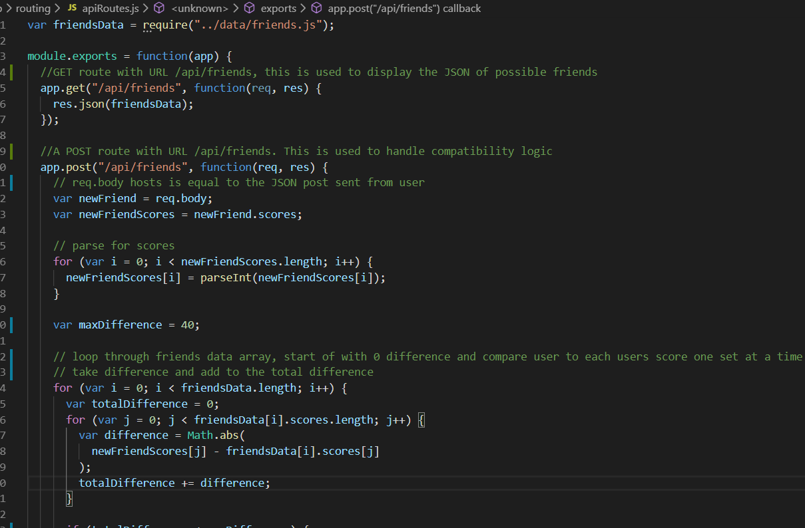
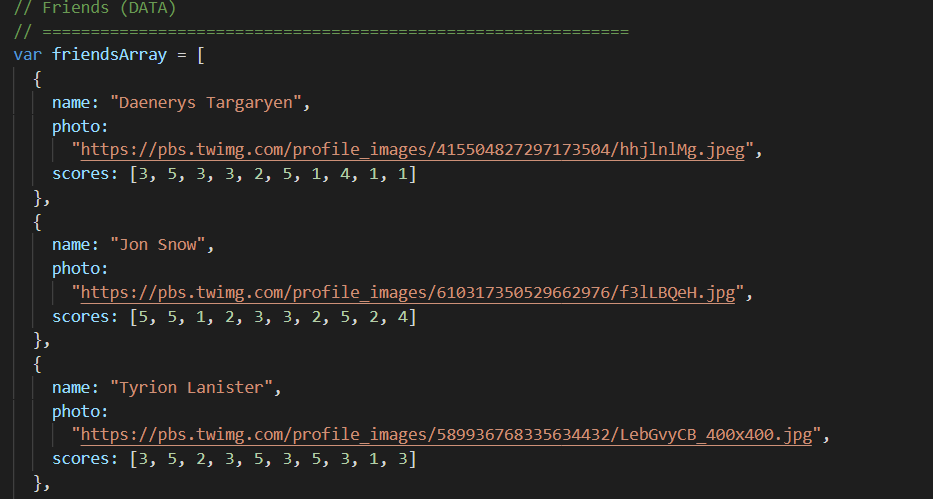
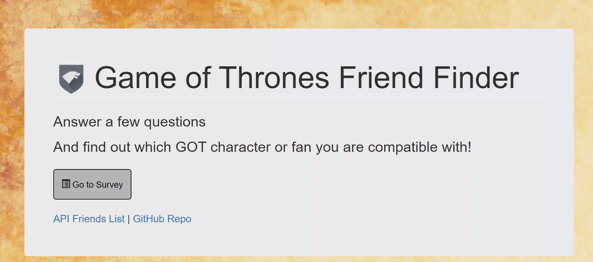
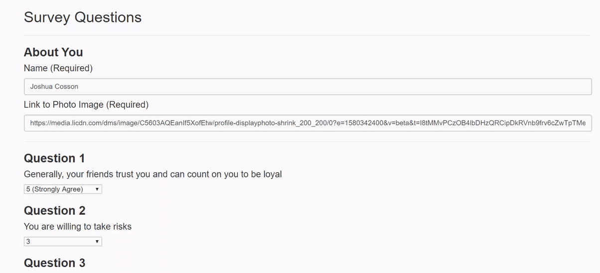

# Game of Thrones FriendFinder

GOT FriendFinder is a compatiblity-based "FriendFinder" that allows you to find out which GOT characcter you are most compatible with. Additionally, after other fans have taken the quick, you may find that you are compatible with them. This full-stack site takes in results of GOT fans, then compares their answers with those form GOT charcters and other users. After submitting the survey questions, the name and picture of the GOT character or fan will display in the results.

The application consists of the following code:

**home.html**

- Is the main page and a default catch-all page for the app
  

**survey.html**

- Is the HTML that contains the survey questions
  

**server.js**

- server.js initiates the server and requires express and path npm packages
  

**htmlRoutes.js**

- Contains a GET route to the survey, swhich displays the survey page, and has a catch-all route to the home.html page
  

**apiRoutes.js**

- apiRoutes.js contains a GET route used to display the JSON of possible friends and contains a POST route with URL /api/friends. This is used to handle compatibility logic
  

friends.js

- friends.js contains the friend data
  

**Running the application and navigating to survey**

**Entering in survey responses and submitting to see results**

**Technologies Used**

- HTML/CSS
- javascript
- Node
- Express Server to handle routing
- Deployed on Heruku

**Link to the Application, Hosted on Heroku**
https://afternoon-wildwood-68459.herokuapp.com/

**Credits**
Developer and app creator: Josh Cosson
